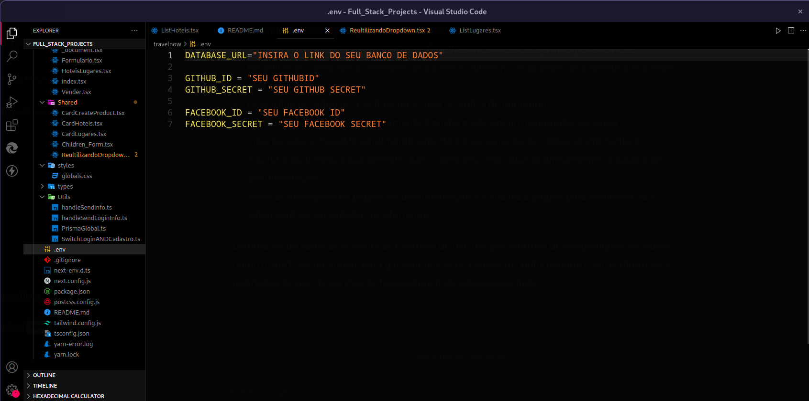
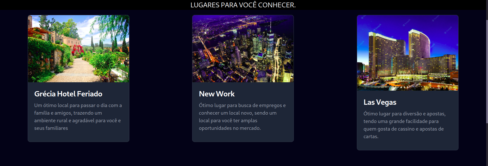
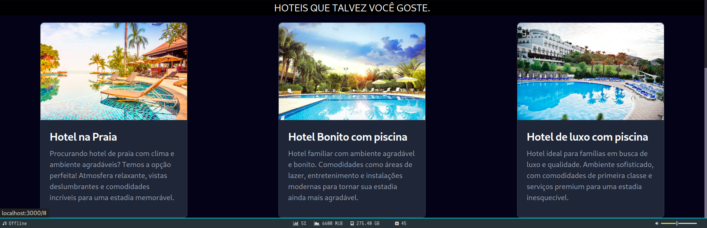
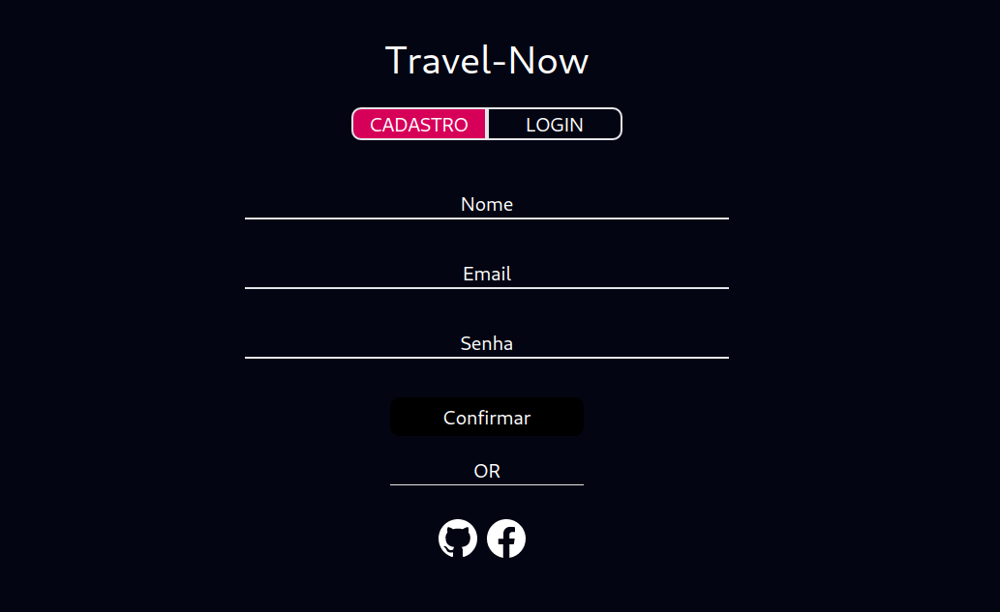
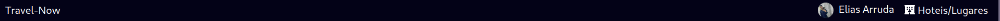
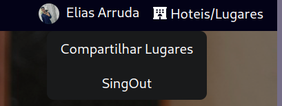
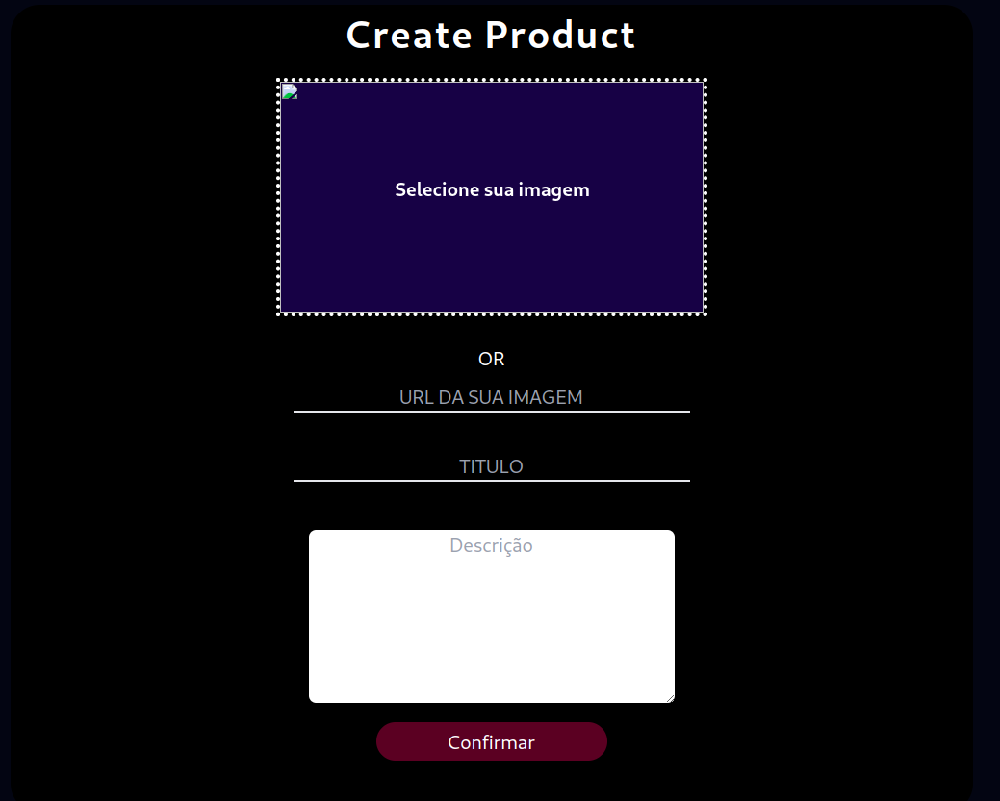
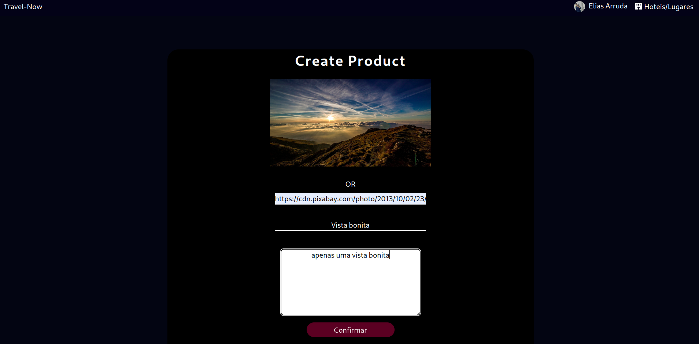
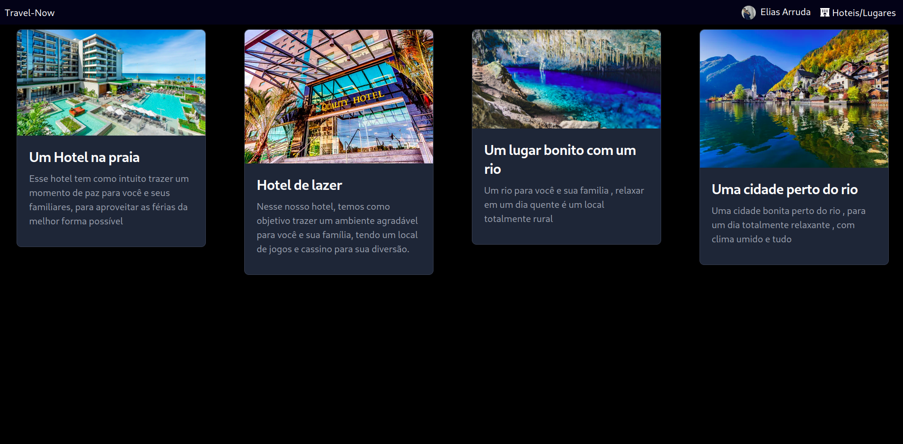

This is a [Next.js](https://nextjs.org/) project bootstrapped with [`create-next-app`](https://github.com/vercel/next.js/tree/canary/packages/create-next-app).

## Getting Started
First, run the development server:

```bash
npm run dev
# or
yarn dev
# or
pnpm dev
```

## NECESSARIO PARA A APLICAÇÃO FUNCIONAR CORRETAMENTE


<br>

# Home


<h2>
Essa é a parte inicial da aplicação
</h2>

<br>

# Lugares


<h2>
Rolando o mouse para baixo, você verá alguns exemplos de alguns cards de cidades
</h2>

<br>

# Lugares


<h2>
É logo após , alguns exemplos de Hoteis
</h2>

<br>

# Profile


<h2>
Ao clicar em 'Perfil', você será redirecionado para um campo de login do usuário.
</h2>

<br>

# Usuario Logado


<h2>
Dependendo da opção de login que você escolher, você será redirecionado para a página inicial, onde irá mostrar seu perfil junto com o seu nome.
</h2>

<br>

# Menu Profile


<h2>
Ao clicar no seu usuário, você terá duas opções: uma de sair e outra de compartilhar um lugar.
</h2>

<br>

# Compartilhando Local


<h2>
Clickando em 'Compartilhar Lugares', você será redirecionado para essa aba, na qual poderá compartilhar qualquer local.
</h2>

<br>

# Exemplo


<h2>
Um exemplo...
</h2>

<br>

# Hoteis/Lugares


<h2>
Automaticamente, você será redirecionado para a aba 'Hotéis/Lugares', que terá anexado o local que você criou.
</h2>